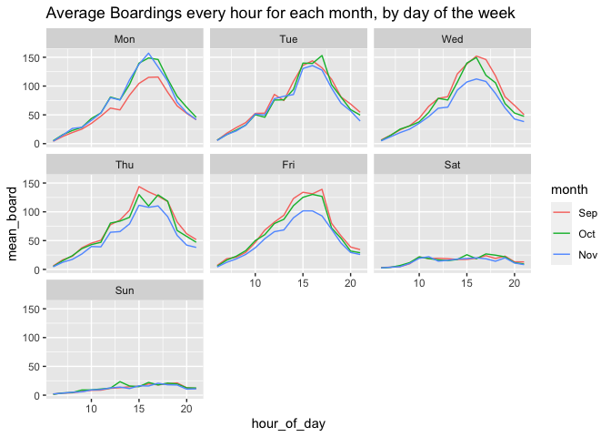
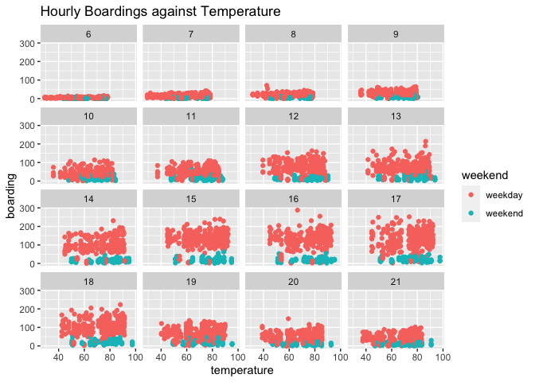

Question - 1
------------

    library(tidyverse)

    capmetro_UT = mutate(capmetro_UT, 
          day_of_week = factor(day_of_week, levels=c("Mon", "Tue", "Wed","Thu", "Fri", "Sat", "Sun")),
              month = factor(month, levels=c("Sep", "Oct","Nov")))

    avg_board = capmetro_UT %>%
      group_by(month, day_of_week, hour_of_day) %>%
      summarise(mean_board = mean(boarding))

    ggplot(avg_board, aes(x = hour_of_day, y = mean_board, color=month)) +
      geom_line() + 
      facet_wrap(~day_of_week) + 
      labs(title = "Average Boardings every hour for each month, by day of the week") 

The hour of peak average boardings are different for everyday if we look
at specific hours. But if we look at broad parts of the day, they are
mostly similar (which is between 3 - 6 pm)

The question of a fall in average boardings in Mondays of September, and
Wed/Thu/Fri of November can be for a number of reasons which are
inclusive of but not exhaustive of factors like the weather, attendence
choice of classes, etc. This might be completely wrong, but this is what
I think because we dont have any further information with the help of
which we can determine the actual reason.

    windows = capmetro_UT %>%
      group_by(hour_of_day) %>%
      summarize(timestamp, temperature, boarding, day_of_week, weekend)

    ## `summarise()` has grouped output by 'hour_of_day'. You can override using the `.groups` argument.

    ggplot(windows) + 
      geom_point(aes(x = temperature, y = boarding, color = weekend)) + 
      facet_wrap(~hour_of_day) + 
      labs(title = "Hourly Boardings against Temperature")

When we keep hour of the day and weekend status constant, the
temperature does not seem to have any significant effect on the
boardings
